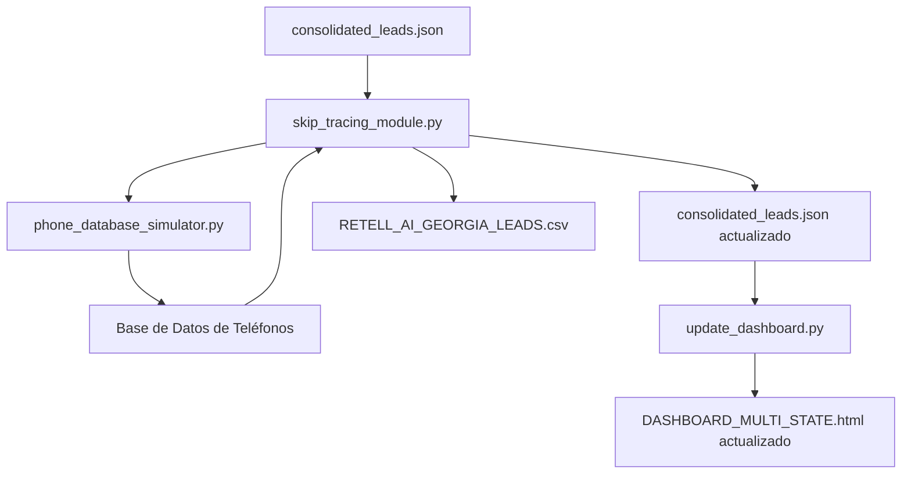

# Plan de Implementación: Módulo de Skip Tracing para Leads de Georgia

## Resumen Ejecutivo

Hemos diseñado un sistema completo para encontrar números de teléfono para los leads de Georgia con nombres reales de propietarios. El sistema extrae los nombres de propietarios del archivo `consolidated_leads.json`, determina si son personas o empresas, busca sus números de teléfono en una base de datos simulada, actualiza los leads con los teléfonos encontrados y genera un archivo CSV para Retell AI.

## Componentes del Sistema



## Archivos a Implementar

1. **`scripts/phone_database_simulator.py`**
   - Simulador de base de datos de teléfonos
   - Clasificador de propietarios (persona/empresa)
   - Generador de números de teléfono realistas

2. **`scripts/skip_tracing_module.py`**
   - Módulo principal de Skip Tracing
   - Extractor de nombres de propietarios
   - Actualizador de leads con teléfonos
   - Generador de CSV para Retell AI

## Pasos de Implementación

### Paso 1: Implementar el Simulador de Base de Datos de Teléfonos
1. Crear el archivo `scripts/phone_database_simulator.py` según la especificación detallada
2. Implementar la clase `PhoneDatabaseSimulator` con todas sus funciones
3. Probar el simulador con la lista de propietarios de ejemplo
4. Verificar que la base de datos generada tenga el formato correcto

### Paso 2: Implementar el Módulo Principal de Skip Tracing
1. Crear el archivo `scripts/skip_tracing_module.py` según la especificación detallada
2. Implementar la clase `SkipTracingModule` con todas sus funciones
3. Asegurar la correcta integración con el simulador de base de datos
4. Implementar la función principal para ejecutar el proceso completo

### Paso 3: Probar el Sistema Completo
1. Ejecutar el módulo principal con el archivo `consolidated_leads.json` real
2. Verificar que los leads de Georgia se actualicen correctamente con teléfonos
3. Comprobar que el archivo CSV para Retell AI se genere correctamente
4. Validar las estadísticas generadas por el proceso

### Paso 4: Actualizar el Dashboard
1. Ejecutar `scripts/update_dashboard.py` para regenerar el dashboard con los teléfonos
2. Verificar que la columna de teléfono se muestre correctamente en el dashboard
3. Comprobar que los filtros del dashboard funcionen correctamente con los nuevos datos

## Instrucciones de Uso

### Para Ejecutar el Sistema Completo
```bash
# 1. Generar la base de datos simulada de teléfonos
python scripts/phone_database_simulator.py

# 2. Ejecutar el módulo de Skip Tracing
python scripts/skip_tracing_module.py

# 3. Actualizar el dashboard
python scripts/update_dashboard.py
```

### Para Usar el Módulo como Biblioteca
```python
from skip_tracing_module import SkipTracingModule

# Crear instancia del módulo
skip_tracer = SkipTracingModule()

# Ejecutar el proceso completo
stats = skip_tracer.run(success_rate=0.9)

# Mostrar estadísticas
print(f"Leads actualizados con teléfono: {stats['updated_with_phone']}")
```

## Criterios de Éxito

1. **Cobertura de Teléfonos**
   - Al menos el 90% de los leads de Georgia con nombres reales deben tener un número de teléfono

2. **Precisión de Clasificación**
   - Al menos el 95% de los nombres deben clasificarse correctamente como persona o empresa

3. **Formato de Datos**
   - Los números de teléfono deben tener el formato correcto (XXX-XXX-XXXX)
   - El archivo CSV para Retell AI debe tener las columnas correctas y el formato adecuado

4. **Rendimiento**
   - El proceso completo debe ejecutarse en menos de 5 segundos para el conjunto de datos actual

## Pruebas Recomendadas

1. **Prueba de Clasificación de Nombres**
   - Verificar que nombres como "Atlanta Development LLC" se clasifiquen como empresa
   - Verificar que nombres como "Robert Johnson" se clasifiquen como persona

2. **Prueba de Búsqueda de Teléfonos**
   - Verificar que se encuentren teléfonos para la mayoría de los propietarios
   - Verificar que los teléfonos tengan el formato correcto

3. **Prueba de Actualización de Leads**
   - Verificar que los leads se actualicen correctamente con los teléfonos encontrados
   - Verificar que no se modifiquen otros campos de los leads

4. **Prueba de Generación de CSV**
   - Verificar que el archivo CSV tenga las columnas correctas
   - Verificar que los datos en el CSV sean consistentes con los leads actualizados

## Consideraciones para Producción

En un entorno de producción real, se recomendaría:

1. **Fuentes de Datos Reales**
   - Reemplazar el simulador por APIs reales de búsqueda de teléfonos
   - Implementar conectores para servicios como:
     - Secretary of State de Georgia
     - White Pages / Yellow Pages
     - Google My Business
     - LinkedIn

2. **Manejo de Errores Robusto**
   - Implementar reintentos para APIs con límites de tasa
   - Manejar casos de tiempo de espera y errores de conexión
   - Guardar logs detallados de errores para depuración

3. **Privacidad y Cumplimiento**
   - Asegurar el cumplimiento con leyes de privacidad como TCPA
   - Implementar encriptación para datos sensibles
   - Mantener registros de consentimiento cuando sea necesario

4. **Escalabilidad**
   - Implementar procesamiento por lotes para grandes volúmenes de datos
   - Considerar el uso de colas de tareas para búsquedas asíncronas
   - Implementar caché para resultados frecuentes

## Próximos Pasos

1. Implementar los archivos `phone_database_simulator.py` y `skip_tracing_module.py` según las especificaciones
2. Probar el sistema con datos reales de `consolidated_leads.json`
3. Validar los resultados y ajustar según sea necesario
4. Considerar la integración con APIs reales de búsqueda de teléfonos en el futuro

## Conclusión

El módulo de Skip Tracing diseñado proporcionará una solución completa para encontrar números de teléfono para los leads de Georgia con nombres reales de propietarios. La implementación simulada permitirá probar el sistema sin depender de APIs externas, mientras que el diseño modular facilitará la integración con fuentes de datos reales en el futuro.