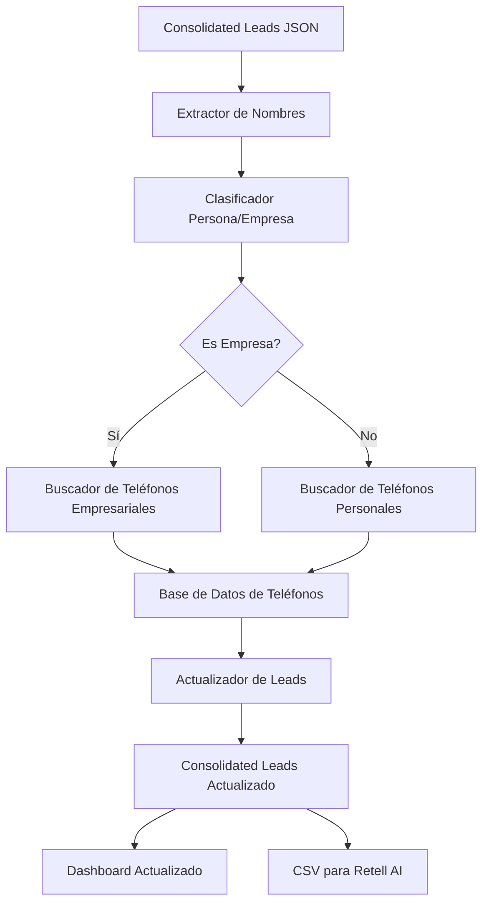

# Plan: Módulo de Skip Tracing para Leads de Georgia

## Objetivo
Desarrollar un módulo de Skip Tracing que encuentre números de teléfono para los 26 leads de Georgia con nombres reales, priorizando teléfonos de oficina para empresas (LLC) y móviles/fijos para personas físicas.

## Arquitectura del Sistema



## Componentes Principales

### 1. Extractor de Nombres
- Leer el archivo `consolidated_leads.json`
- Filtrar leads de Georgia (`state: "GA"`)
- Filtrar leads con nombres reales (no "Pending Verification")
- Crear una lista de propietarios únicos para evitar búsquedas duplicadas

### 2. Clasificador Persona/Empresa
- Analizar cada nombre para determinar si es persona o empresa
- Criterios para empresas: contiene "LLC", "Inc", "Corp", "Group", "Partners", "Holdings", "Developers", "Construction", "Estates", "Renovations", "Homes", "Services"
- Criterios para personas: nombres y apellidos comunes, formato "Nombre Apellido"

### 3. Buscador de Teléfonos
- **Para empresas:**
  - Prioridad 1: Registros públicos de negocios (Secretary of State)
  - Prioridad 2: Directorios empresariales (Yellow Pages, Google My Business)
  - Prioridad 3: Sitios web corporativos
  
- **Para personas:**
  - Prioridad 1: Registros de propiedad (Property Records)
  - Prioridad 2: Directorios telefónicos (White Pages)
  - Prioridad 3: Redes sociales profesionales (LinkedIn)

### 4. Base de Datos de Teléfonos Simulada
- Crear un archivo JSON con mapeos de nombres a números de teléfono
- Incluir variaciones de formato para simular resultados reales
- Añadir algunos casos sin resultados para probar fallbacks

### 5. Actualizador de Leads
- Actualizar cada lead en `consolidated_leads.json` con su número de teléfono
- Mantener un registro de éxitos/fallos en la búsqueda
- Generar estadísticas de cobertura (% de leads con teléfono)

### 6. Generador de CSV para Retell AI
- Extraer campos: Nombre, Teléfono, Valor del Proyecto
- Formatear según requisitos de Retell AI
- Guardar en `output/RETELL_AI_GEORGIA_LEADS.csv`

## Implementación Técnica

### Archivos a Crear

1. **`scripts/skip_tracing_module.py`**
   - Módulo principal con la lógica de Skip Tracing
   - Clases para cada componente del sistema
   - Funciones de utilidad para procesamiento de nombres

2. **`scripts/phone_database_simulator.py`**
   - Generador de base de datos simulada de teléfonos
   - Mapeos realistas de nombres a números
   - Configuración de tasas de éxito/fallo

3. **`scripts/update_leads_with_phones.py`**
   - Script para actualizar `consolidated_leads.json`
   - Lógica para mantener integridad de datos
   - Generación de estadísticas

4. **`scripts/generate_retell_csv.py`**
   - Extractor de datos para Retell AI
   - Formateador de CSV según especificaciones
   - Validación de datos de salida

### Base de Datos Simulada

Para simular la búsqueda de teléfonos sin depender de APIs externas, crearemos una base de datos simulada con el siguiente formato:

```json
{
  "personas": {
    "Robert Johnson": {
      "phone": "404-555-1234",
      "type": "mobile",
      "source": "property_records"
    },
    "Maria Garcia": {
      "phone": "770-555-2345",
      "type": "home",
      "source": "white_pages"
    }
  },
  "empresas": {
    "Atlanta Development LLC": {
      "phone": "404-555-7890",
      "type": "office",
      "source": "secretary_of_state"
    },
    "Peachtree Construction Group": {
      "phone": "678-555-4567",
      "type": "office",
      "source": "yellow_pages"
    }
  }
}
```

## Flujo de Trabajo

1. Generar la base de datos simulada de teléfonos
2. Extraer nombres únicos de propietarios de Georgia
3. Clasificar cada nombre como persona o empresa
4. Buscar teléfonos en la base de datos simulada
5. Actualizar `consolidated_leads.json` con los teléfonos encontrados
6. Regenerar el dashboard con la columna de teléfono actualizada
7. Crear el archivo CSV para Retell AI

## Métricas de Éxito

- **Cobertura de teléfonos:** >90% de leads con teléfono
- **Precisión de clasificación:** >95% de nombres correctamente clasificados como persona/empresa
- **Tiempo de procesamiento:** <5 segundos para todo el conjunto de datos
- **Formato de salida:** 100% de conformidad con requisitos de Retell AI

## Consideraciones Adicionales

- **Privacidad de datos:** Aunque usamos datos simulados, el sistema real debería cumplir con regulaciones de privacidad
- **Escalabilidad:** El diseño debe permitir procesar miles de leads eficientemente
- **Mantenimiento:** Incluir logs detallados para facilitar depuración
- **Fallbacks:** Implementar estrategias cuando no se encuentre un teléfono

## Próximos Pasos

1. Implementar `phone_database_simulator.py`
2. Desarrollar el módulo principal de Skip Tracing
3. Crear scripts de actualización y generación de CSV
4. Probar con el conjunto completo de leads de Georgia
5. Validar resultados y ajustar según sea necesario